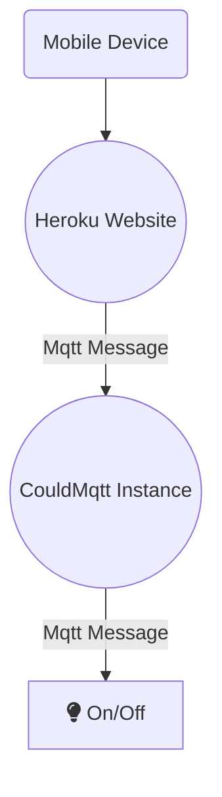

# rpi-iot

Create a website to control lights and other devices
Tools
- Raspberry Pi Zero W to control the lights or device
- Free CloudMqtt instance to control messages between the web client, the pi,  and the devices
- Free Heroku host to run the website

# Setup Notes
## Set Up Raspberry Pi Zero W
Use RaspberryPi Zero W without a monitor
  - https://www.losant.com/blog/getting-started-with-the-raspberry-pi-zero-w-without-a-monitor
  
  Copy the `RaspberryPiFile.py` to your pi

  
How to Keep the Script on the Pi Running After Closing Terminal
  - Before running the python script, enter the command `screen`
  - Run `python RaspberryPiFile.py`
  - Now you can close out of the terminal and the script will contine to run

## Setup CloudMqtt

  
Create a free instance
https://customer.cloudmqtt.com/instance/create

Go the the `Users & ACL` tab on the left
- Under `users` enter a name and password
- Under `ACL` set the `type` to `topic`, under `pattern` select the user you just created in the previous step, then create a `topic` name in the next box that has they grey text `pattern`.
- Select `read` and `write` then click the green `Add` button.
- To test that CloudMqtt is set up properly, go to the `Websocket UI` tab on the left
	-	Under `topic` enter the name of the topic you just created
	-	Enter a message, and that message should pop up on the right under `received messages`

## Setup Heroku
Setup Node Environment on Heroku
- https://devcenter.heroku.com/articles/getting-started-with-nodejs#set-up

Setting Environment Variables for the Web App
  - https://devcenter.heroku.com/articles/config-vars

How to deploy changes once Heroku is set up
- `git add *`
- `git commit -m 'updated xyz`
- `git push heroku master`
